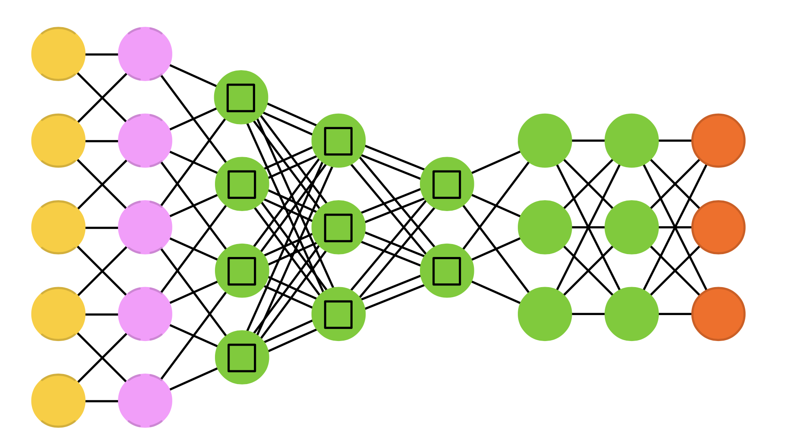

# Neural Networks
by [Amanda Oliveira](https://www.linkedin.com/in/amanda-guedes-de-oliveira-0776366a/)

#### **Goals for this project**

Neural networks are not a new method, the first artificial neural network was devised in 1943, but advances in computational power and speed have made them a much more viable strategy for solving complex problems over the last 5-10 years. Originally devised by mathematicians and neuroscientists to illustrate the fundamental principles of how brains might work they lost favor in the second half of the 20th century only to surge in popularity in the 20-teens as software engineers used them to resolve mathematically intractable problems. The application of neural networks to learning problems has been ongoing for 20 years, often to predict student behavior or to parse unstructured data such as student writing samples and provide natural sounding feedback through AI avatars.

In this unit you will be building a neural network to predict student attention state from webcam images. Through this application I will attempt to:
* Illustrate the utility of artificial neural networks
* Explain the backpropagation algorithm

#### **Resources**

######  **Readings**

[Nielsen, M. (2015). Neural Networks & Deep Learning. Chapter 1. Determination Press:San Francisco, CA](http://neuralnetworksanddeeplearning.com/chap1.html)  

[Nielsen, M. (2015). Neural Networks & Deep Learning. Chapter 2. Determination Press:San Francisco, CA](http://neuralnetworksanddeeplearning.com/chap2.html)  

[McKlin, T., Harmon, S. W., Evans, W., & Jones, M. G. (2001). Cognitive presence in Web-based learning: A content analysis of students' online discussions.](https://files.eric.ed.gov/fulltext/ED470101.pdf)  

[Stergiou, C. & Siganos, D. (2000). Neural Networks.](http://www.doc.ic.ac.uk/~nd/surprise_96/journal/vol4/cs11/report.html)

[Hartnett, K. (2019). Foundations Built for a General Theory of Neural Networks](https://www.quantamagazine.org/foundations-built-for-a-general-theory-of-neural-networks-20190131/)

[Lewis-Kraus, G. (2016). The Great AI Awakening. The New York Times: New York, NY](https://www.nytimes.com/2016/12/14/magazine/the-great-ai-awakening.html)

[Roberts, E. (2000). History in Neural Networks. Stanford University: Palo Alto, CA](https://cs.stanford.edu/people/eroberts/courses/soco/projects/neural-networks/History/history1.html)

###### **Videos**

[Introduction to Neural Networks](https://youtu.be/x54ULLJSzBM)

[Video Slide Deck](https://github.com/la-process-and-theory/neural-networks/blob/master/HUDK4051-neural-nets.pdf)

[Sanderson, G. (2017). But what *is* a Neural Network? 3Blue1Brown. ](https://www.youtube.com/watch?v=aircAruvnKk)

[Bling, S. (2017). MariFlow - Self-Driving Mario Kart with Recurrent Neural Network](https://www.youtube.com/watch?v=Ipi40cb_RsI)

